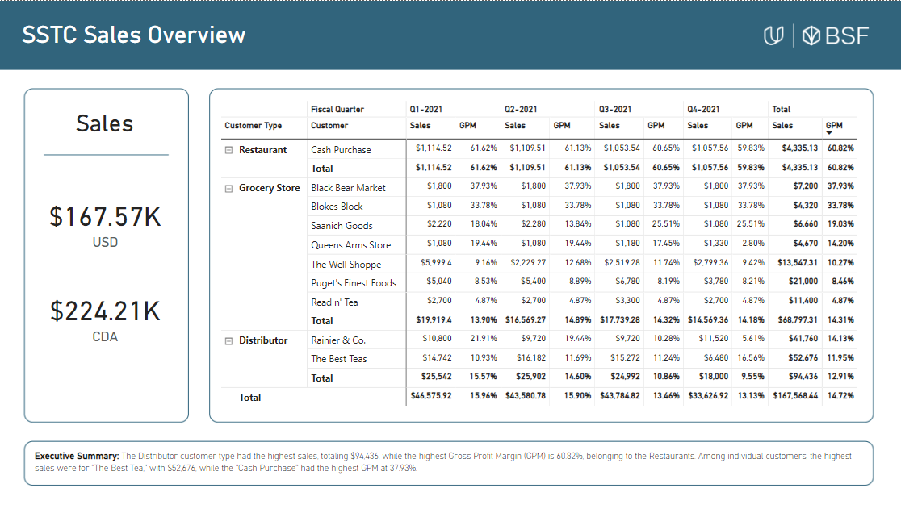
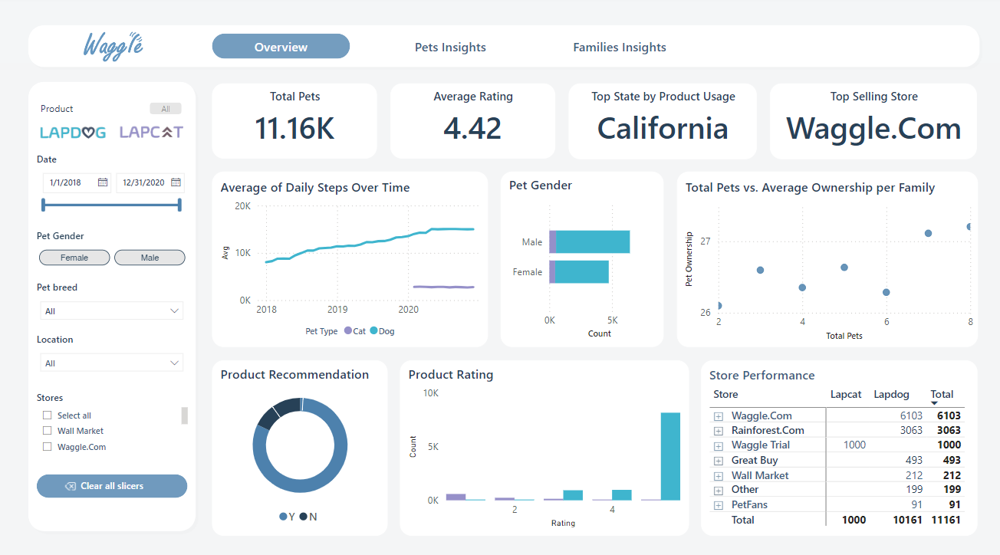
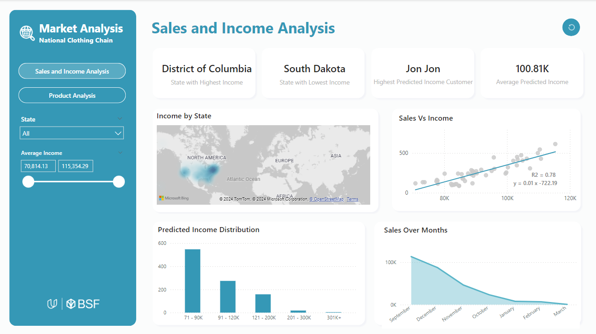

# Data Analysis and Visualization with Microsoft Power BI BSF  
## README File  

### Project 1: Data Model for Seven Sages Company (SSTC)  
- **Data Transformation**: Cleaned and organized data using Power Query.  
- **Data Model**: Established relationships between fact and dimension tables (currency, customer, product, and date).  
- **DAX Measures**: Created key performance indicators (Sales in USD/CAD, Gross Profit Margin, and Unit Sales).
  

### Project 2: Power BI Report for Waggle  
- **Analysis**: Compared daily steps and ratings of Lapdog vs. Lapcat.  
- **Visualizations**: Included bar charts, line charts, scatter plots, slicers, and custom themes.  
- **Interactivity**: Utilized bookmarks, slicers, and buttons for enhanced navigation and filtering.

### Project 3: Market Analysis for National Clothing Chain  
- **Data Cleaning**: Used Power Query to format and un-pivot purchase data.  
- **DAX Formulas**: Generated income-based histograms and product recommendations.  
- **Visualizations**: Applied heatmaps, scatter plots, and linear regression to analyze income distribution and sales trends.

